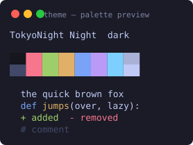
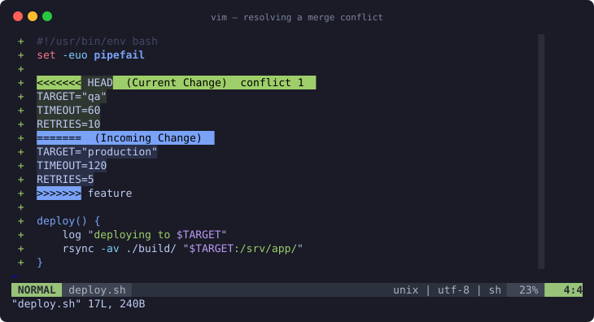

## dotfiles

Personal dotfiles for macOS and Linux: zsh, vim/nvim, tmux, git, bash.

Deployed with [GNU stow](https://www.gnu.org/software/stow/) as **symlinks**, not
copies. Editing `~/.vimrc` edits `vim/.vimrc` in this repo, so `git status` is
always the truth and there is nothing to copy back by hand.

### Install

```bash
brew install stow          # macOS
sudo apt install stow      # Debian/Ubuntu

git clone git@github.com:emergesource/dotfiles.git ~/devel/dotfiles
cd ~/devel/dotfiles
./install.sh               # -n to dry run, -D to remove
```

`install.sh` bootstraps oh-my-zsh if it is missing, then stows every package.
Packages are stowed with `--no-folding` so that `~/.vim` and `~/.config` stay
real directories: `~/.vim/plugged` and the various unmanaged app configs under
`~/.config` have to coexist with the linked files.

### Layout

Each top-level directory is a stow package mirroring its target layout under
`$HOME`.

| Package | Contents |
|---------|----------|
| `zsh` | `.zshrc`, `.p10k.zsh` |
| `vim` | `.vimrc`, `.vim/{autoload,colors,UltiSnips}` |
| `nvim` | `.config/nvim/init.vim` — sources `~/.vimrc`, so vim and nvim share one config |
| `tmux` | `.tmux.conf`, `.config/tmuxinator/` |
| `git` | `.gitconfig` |
| `bin` | `bin/` — on `$PATH`, includes `theme` |
| `newsboat` | `.newsboat/` |
| `bash` | `.bashrc`, `.bash_profile` |
| `linux` | `.fonts/` — stowed on Linux only |

Repo infrastructure (`README.md`, `CLAUDE.md`, `Brewfile`, `install.sh`,
`.gitignore`, `.rsyncignore`) lives at the root, outside any package, and is
never deployed.

### Theming

`theme` switches iTerm2, vim and tmux colours together.

```bash
theme                 # picker — colours apply live as you move, Enter keeps, Esc restores
theme browse          # pick from ~600 upstream themes, installs on select
theme next            # cycle without the picker (also: prev)
theme set nord        # apply an installed theme
theme list            # what's installed
```



The vim statusline is native — no plugin — and takes its mode colours from the
same palette, so it matches every theme rather than only the handful a
statusline plugin ships palettes for.

Themes come from
[iTerm2-Color-Schemes](https://github.com/mbadolato/iTerm2-Color-Schemes), which
publishes a palette and a vim colorscheme per theme. The tmux status theme is
generated locally from the same palette, so all three layers always agree.

State lives in `~/.config/theme/`, outside this repo, where `current` is a
symlink to the active theme. The configs reference that stable path — `.vimrc`
sources `current/theme.vim`, `.tmux.conf` sources `current/tmux.conf` — so
switching is just repointing the symlink.

Notes:

- iTerm is recoloured with an escape sequence, not by importing presets, so your
  iTerm profile is never modified and this works over SSH.
- Because those colours are per-session, `.zshrc` runs `theme reapply` at startup
  — otherwise a new window reverts to the profile's colours.
- A running vim recolours when its pane regains focus, not instantly: vim here is
  `+clientserver` but `-X11` and cannot be remote-controlled. New vim instances
  pick the theme up immediately.
- Requires `allow-passthrough on` and `focus-events on` in tmux; both are set in
  `.tmux.conf`. Truecolor (`tmux-256color` + `RGB`) is enabled so themes render
  as designed rather than being quantised to 256 colours.

### Merge conflicts

Resolved inline, in one buffer — no diff splits — using VS Code's vocabulary.



```
,x                     the Resolve Conflict menu
]x  [x                 next / previous conflict
:AcceptCurrentChange   :AcceptIncomingChange
:AcceptBothChanges     :DiscardBothChanges
```

Colours are derived from the active theme, with foregrounds picked by WCAG
contrast, so the labels stay readable whatever `theme` is set to.

### Packages

```bash
brew bundle          # macOS, reads ./Brewfile
./bin/ubuntu.sh      # Linux, apt
```

### Plugin managers

Not vendored; install once per machine.

- **vim**: vim-plug is vendored at `vim/.vim/autoload/plug.vim`; run `:PlugInstall`.
- **tmux**: clone tpm to `~/.tmux/plugins/tpm`, then `prefix + I`.
- **zsh**: oh-my-zsh + powerlevel10k, handled by `install.sh`.

### Backup pgp key
```
gpg --armor --export > pgp-public-keys.asc
gpg --armor --export-secret-keys > pgp-private-keys.asc
gpg --export-ownertrust > pgp-ownertrust.asc
```

### Restore pgp key
```
gpg --import pgp-public-keys.asc
gpg --import pgp-private-keys.asc
gpg --import-ownertrust pgp-ownertrust.asc
```
